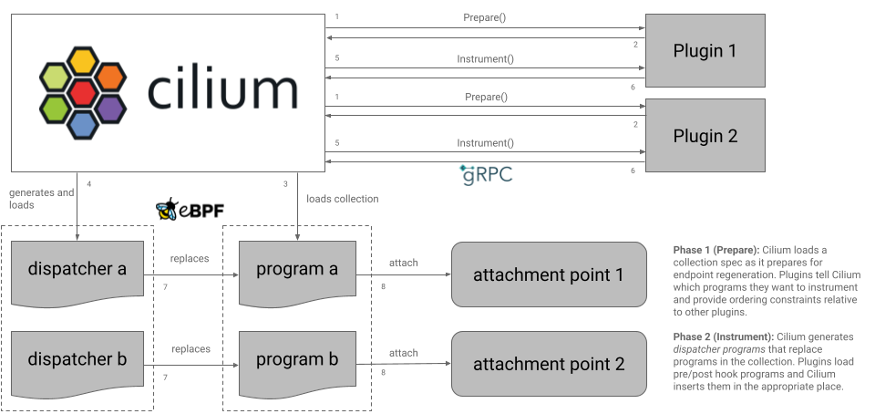
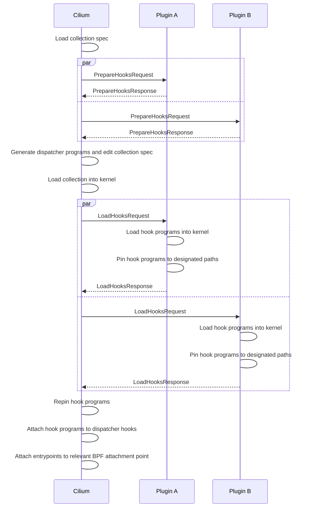
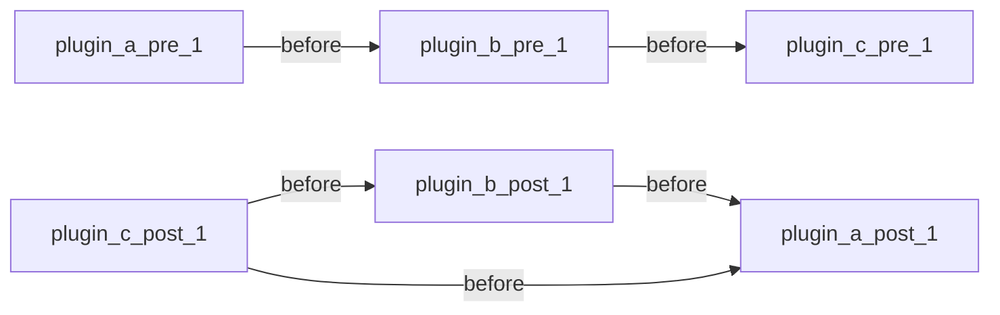
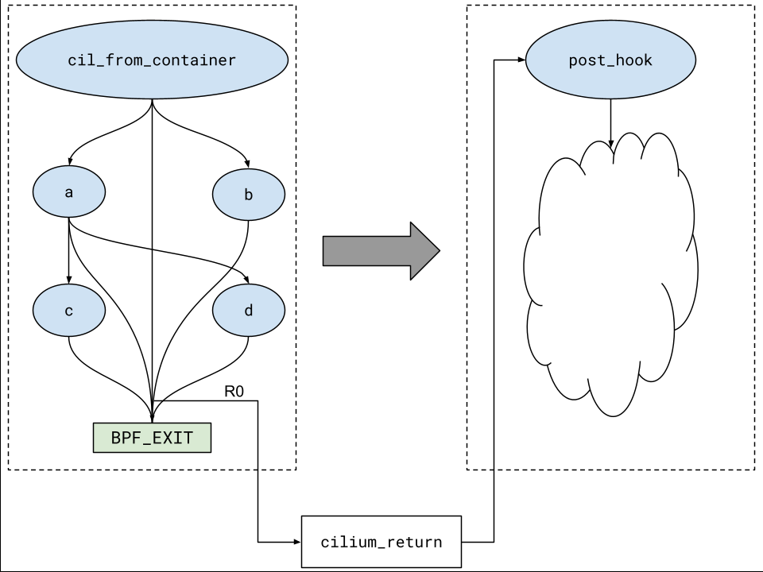
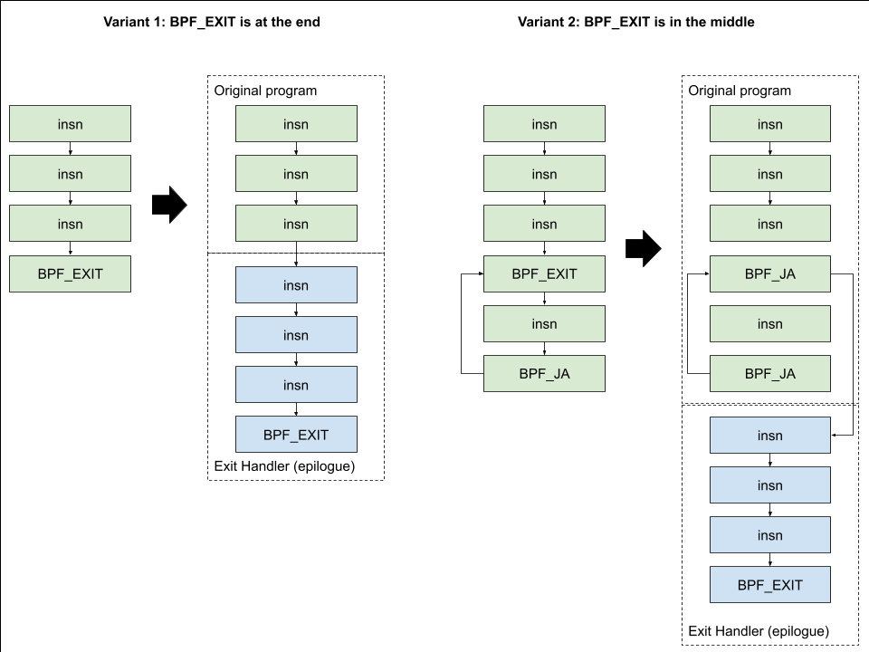

# CFP-41634: Datapath Plugins

**SIG: SIG-DATAPATH**

**Begin Design Discussion:** 2025-08-25

**Cilium Release:** 1.20

**Authors:** Jordan Rife <jrife@google.com>

**Status:** Implementable

**Proof Of Concept:** https://github.com/cilium/cilium/pull/41508

## Summary

Allow operators of Cilium to integrate their own BPF programs into the Cilium
datapath to enable custom BPF-based observability, encapsulation, and routing
solutions.

## Motivation

As a cloud provider, we operate thousands of Cilium-enabled clusters in an
environment where other teams and even savvy customers want to deploy their
own BPF-based solutions alongside Cilium for various purposes. Their motivations
are varied, but tend to fall into several categories:

* Custom transparent proxies
* Custom observability
* Custom encapsulation and routing

Cilium isn't the only component we manage, and while it forms the core of our
datapath, we need to combine it with other systems. Up until now, we've needed
to steer other teams and customers away from using BPF at all in their
solutions, as there was no good way to deploy it and too many places where
Cilium could get in the way.

BPF continues to increase in popularity and others want to use it to solve their
problems. This proposal seeks to make this easier.

## Goals

* Allow for easy integration of non-Cilium BPF programs into the datapath by
  leveraging Cilium's loader infrastructure. Allow for attachment of custom
  programs that run before or after any Cilium-managed attachment to influence
  or override verdicts, override redirection decisions, etc.
* Be as hands off as possible and avoid placing any restrictions or requirements
  on Cilium's BPF code. We want to avoid placing an undue maintenance burden on
  Cilium to support datapath plugins.

## Non-Goals

* Ensuring that all datapath plugins are compatible with all Cilium features
  or versions. In the spirit of "avoid placing an undue maintenance burden", it
  is the responsibility of those developing datapath plugins to ensure that
  their plugin works as intended in their environment against their chosen
  Cilium configuration and version. Due to the tightly-coupled nature of the
  datapath, it's easy to break Cilium features with a poorly-designed plugin
  and hard to design a plugin that considers all possible configurations.
* Supporting a plugin ecosystem. Datapath plugins are targeted at operators
  with deep knowledge and experience with Cilium who are able to understand
  their plugin's interactions with the rest of the system. This feature is not
  aimed at your average Cilium user and, at least at present, we do not intend
  for this to become something like Kubernetes CSI or CNI where the average
  user can combine third party off-the-shelf plugins with Cilium.

## Proposal

*This design is accompanied by a [proof of concept](https://github.com/cilium/cilium/pull/41508)
with a full implementation of the design as described below along with an
example datapath plugin that implements a transparent HTTP proxy example. Any
code samples are pulled from there.*

### Overview



A *datapath plugin* runs as a standalone pod on the same host as the Cilium
agent. Cilium talks to the plugin through a gRPC interface exposed via Unix
socket:

```grpc
service DatapathPlugin {
    rpc PrepareHooks(PrepareHooksRequest) returns (PrepareHooksResponse) {}
    rpc LoadHooks(LoadHooksRequest) returns (LoadHooksResponse) {}
}
```

* Datapath plugins are registered by creating a `CiliumDatapathPlugin` custom
  resource.
* Cilium connects to registered datapath plugins on startup.
* When preparing a BPF collection for an attachment point, where attachment
  points can be a network interface's XDP or TC(x) hooks, or cgroup hooks such
  as SOCK_ADDR or SOCKOPS, Cilium coordinates with plugins in two phases:
  1. `PrepareHooks`: In the first phase, Cilium makes a `PrepareHooks` request
     to all registered plugins to determine if any of them would like to insert
     a pre/post hook around a BPF attachment in the collection. Plugins provide
     Cilium with the position of any hooks they would like to insert as well as
     a set of ordering constraints that determine relative hook order between
     different plugins.
  2. `LoadHooks`: Cilium constructs *dispatcher programs* that invoke the
     original entrypoint but sandwich it between a set of pre and post hooks.
     After generating and loading this dispatcher program, Cilium sends
     a round of `LoadHooks` requests to the plugins so that they may load
     programs for these hook points. Plugins pass ownership of these programs
     back to the Cilium agent where the Cilium agent then replaces hook points
     with these hook programs.
* Pre-Cilium hooks give the plugin the opportunity to do something before
  executing the main Cilium attachment while post-Cilium hooks give the plugin
  the opportunity to do something after the main Cilium attachment. The exact
  semantics of pre and post hooks depend on the attachment type. This design
  focuses on TC hooks but leaves the door open for future extensions to support
  instrumentation of XDP and cgroup attachments in the future.

### Plugin Registration, Deployment, And Configuration

To enable datapath plugins, users set the `datapath-plugins-enabled` flag and
point `datapath-plugins-unix-socket` to the path where Cilium will create a Unix
socket.

```
flags.Bool("datapath-plugins-enabled", c.DatapathPluginsEnabled, "Flag to enable datapath plugins.")
flags.String("datapath-plugins-unix-socket", c.DatapathPluginsUnixSocket, "Path to a UNIX domain socket for talking to a Cilium datapath plugin.")
```

Each datapath plugin connects to the Unix socket at the path specified
by `datapath-plugins-unix-socket`. Beyond that, it's up to the plugin author
to determine how they want to deploy and configure their plugin, although likely
it will just be another `DaemonSet`. With a connection between Cilium and the
plugin established, the plugin must handle `PrepareHooks` and `LoadHooks`
requests as Cilium sends them.

#### Plugin Registration

Creating a `CiliumDatapathPlugin` resource registers a datapath plugin with
Cilium. If a `CiliumDatapathPlugin` resource is created or deleted while Cilium
is running, it regenerates endpoints to keep the datapath in sync with the
desired state.

```yaml
apiVersion: cilium.io/v1beta1
kind: CiliumDatapathPlugin
metadata:
  name: my-datapath-plugin
spec:
  attachmentPolicy: Always # Always, BestEffort, Eventually
```

`.spec` contains configuration options that determine how Cilium interacts with
a plugin. It may be extended to add new plugin configuration options, but for
now it will only contain `.spec.attachmentPolicy`. `.spec.attachmentPolicy`
determines whether or not Cilium is required to consult a plugin while
regenerating an endpoint and how Cilium should react when connectivity to a
plugin is (re)established. `Always` means a plugin is required and Cilium will
reattempt endpoint regeneration until the plugin is up and responds
successfully. This is suitable for plugins that deal with policy, redirection,
or other critical decisions where the datapath doesn't work without them.
Both `BestEffort` and `Eventually` means that a plugin is not required and
Cilium will proceed with endpoint regeneration even if the plugin is not
connected or does not respond to a request. `Eventually` adds the condition
that Cilium should trigger endpoint regeneration when a plugin reconnects. Both
`BestEffort` and `Eventually` are suitable for observability-related plugins
where functionality is not impacted if they aren't loaded.

`.status` may report additional conditions and events related to a plugin like
its current health or state.

### Interface And Interactions

For now, the aim is to keep the interface is minimal and stateless as possible.
The plugin is only responsible for loading and pinning a program; Cilium takes
over its lifecycle after that.

#### gRPC Interface

```proto
service DatapathPlugin {
    rpc PrepareHooks(PrepareHooksRequest) returns (PrepareHooksResponse) {}
    rpc LoadHooks(LoadHooksRequest) returns (LoadHooksResponse) {}
}

// LocalNodeConfig may be used to inform which hooks to load or how to
// configure them.
message LocalNodeConfig {
    // TBD
}

// AttachmentContext contains the context about the attachment point in
// question. It may carry endpoint-specific information used to determine which
// hooks to load or how to configure them.
message AttachmentContext {
    message TC {
        message EndpointConfig {
            // Contains endpoint-specific config (IP, MAC, etc.)
        }

        EndpointConfig ep_config = 1;
    }

    message XDP {
        // Could potentially contain details relevant to an XDP attachment
        // point.
    }

    message CgroupSock {
        // Could potentially contain details relevant to a SOCK_ADDR or
        // SOCKOPS attachment point.
    }

    oneof context {
        TC tc = 1;
        XDP xdp = 2;
        CgroupSock cgroup_sock = 3;
    }
}

enum HookType {
    PRE = 1,
    POST = 2,
}

// Phase 1: As Cilium loads and prepares a collection for a particular
// attachment point, it sends a PrepareHooksRequest to each plugin with context
// about the attachment point, collection, and local node config. The plugin
// decides which hooks it would like to insert, where it would like to insert
// them, and informs Cilium in the PrepareHooksResponse
message PrepareHooksRequest {
    message CollectionSpec {
        message ProgramSpec {
            string name = 1;
        }

        repeated ProgramSpec programs;
    }

    CollectionSpec collection = 1;
    LocalNodeconfig local_node_config = 2;
    AttachmentContext attachment_context= 3;
}

message PrepareHooksResponse {
    message HookSpec {
        // An OrderingConstraint is a constraint about where this hook should
        // go at this hook point relative to other plugins' hooks.
        message OrderingConstraint {
            enum Order {
                BEFORE = 1,
                AFTER = 2,
            }
            Order order = 1,
            string plugin = 2,
        }
        // PRE/POST (for now)
        HookType type = 1;
        // Which program are we instrumenting?
        string target = 2;
        repeated OrderingConstraint constraints = 3;
    }

    repeated HookSpec hooks = 1;
    string cookie = 2;
}

// Phase 2: Cilium has constructed and loaded the collection along with any
// dispatcher programs that are meant to replace existing entrypoints in the
// collection. Cilium sends a round of requests to any plugins that wanted to
// inject hooks.
message LoadHooksRequest {
    // Program and map IDs in the collection
    message Collection {
        // Would contain information about programs and maps in this collection
        // such as names, IDs, etc. This could be consumed by plugin programs
        // themselves, e.g., for sharing map state.
    }

    message Hook {
        message AttachTarget {
            uint64 program_id = 1;
            string subprog_name = 2;
        }

        HookType type = 1;
        string target = 2;
        // Contains target metadata necessary for freplace program load.
        AttachTarget attach_target = 3;
        // The plugin must pin the program to this pin path before responding
        // to Cilium.
        string pin_path = 4;
    }

    
    Collection collection = 1;
    LocalNodeconfig local_node_config = 2;
    AttachmentContext attachment_context= 3;
    repeated Hook hooks = 4;
    string cookie = 5;
}

message LoadHooksResponse {
}
```

#### Coordination



As Cilium is loading a BPF collection and preparing it for an attachment point
or set of related attachment points, whether they be TC attachments for a
network interface, an XDP attachment, or a cgroup attachment as with SOCK_ADDR
and SOCKOPS hooks, it sends two rounds of gRPC requests to all registered
plugins allowing them to instrument the collection with hooks that run before
(pre) or after (post) programs in that collection. For now, only *entrypoints*
are allowed to be instrumented, the top-level program Cilium attaches to a BPF
attachment point, but this constraint could easily be loosened in the future to
allow for more fine-grained instrumentation of the collection by a plugin.

1. After loading the collection spec but before loading the collection into the
   kernel, Cilium sends plugins a set of `PrepareHooks` requests containing all
   the context about the collection, the attachment point, and local node
   configuration. The plugin uses this information to determine which of
   Cilium's programs (if any) it would like to instrument. The `PrepareHooks`
   response specifies the list of pre or post program hooks that the plugin
   would like to inject. Each hook specification may contain a set of ordering
   constraints which express to Cilium that this particular hook must be placed
   before or after those of another plugin at that same hook point.
2. After receiving all `PrepareHook` responses, if any plugin has indicated that
   it would like to inject a hook before or after some program in the
   collection, Cilium generates a *dispatcher program* in its place which
   invokes any pre hooks, invokes the original program, and finally invokes any
   post hooks. The original collection spec is modified to replace the original
   program with this dispatcher program while the original program is retained
   but renamed and invoked as a subprogram. The dispatcher mechanism and its
   generation will be covered in more detail in following sections. For now,
   suffice it to say that Cilium generates these dispatchers with pre or post
   hook invocations implemented by dummy placeholder subprograms that it also
   injects into the collection spec.
3. Cilium loads the modified collection into the kernel.
4. Cilium creates an ephemeral request-specific subdirectory in BPFFS to contain
   hook program pins for this load operation, e.g.
   `/sys/fs/bpf/cilium/operations/6a950f84-d8c0-468f-a8e5-c30545fd1ca5` and maps
   each pre/post hook to a unique pin path within this directory, e.g.
   `/sys/fs/bpf/cilium/operations/6a950f84-d8c0-468f-a8e5-c30545fd1ca5/1`. No
   pins are actually created at this point.
5. Cilium sends a `LoadHooks` request to any plugin that provided a hook
   specification in the previous round. Each `LoadHooks` request contains the
   same local node configuration and attachment context information that was in
   the preceding `PrepareHooks` along with a list of hooks mirroring those
   requested by the plugin in its `PrepareHooks` response. Each hook contains an
   `attach_target`, providing all the context the plugin needs to load the
   `BPF_PROG_TYPE_EXT` hook program into the kernel, and the unique `pin_path`
   for this hook that Cilium generated in the previous step.
6. Each plugin loads hook programs and pins them to the designated pin paths
   before responding to the `PrepareHooks` request.
7. Cilium opens and unpins the hook programs then replaces the dispatcher
   subprograms with these programs which creates a set of freplace links that
   Cilium then pins to a location associated with the lifecycle of the
   attachment point in question.
8. With the collection finalized, Cilium attaches collection entrypoints (
   dispatchers or otherwise) to the relevant BPF attachment points in the
   kernel.

#### Backwards and Forwards Compatibility

Cilium sends the Cilium agent version with every request as gRPC metadata. The
plugin may use this to decide what programs to load or how to configure those
programs. It is the plugin's responsibility to adapt to architectural changes
within the Cilium datapath. In other words, Cilium can make breaking changes
between versions from from the perspective of the plugin, and the plugin must
react by changing its architecture.

Cilium will make a best effort attempt to evolve the gRPC interface itself in
a way that maintains backwards compatibility. It's possible that existing
protobufs will be extended in the future or that the gRPC interface will be
extended.

##### Upgrades

A datapath plugin should be tested and qualified against a new version of
Cilium, version N+1, before being deployed. A plugin should support at least
Cilium versions N and N+1 and can use the Cilium version metadata supplied in
each gRPC request to determine how to program the datapath appropriately.
Datapath plugins should be upgraded before upgrading Cilium in a cluster to
ensure a smooth transition.

#### Program Lifecycles

In general, datapath plugins should only load resources during a `LoadHooks`
request and should release those resources before responding to the request.
In particular, this means that it should close any program or map file
descriptors that it created during the request after pinning hook programs to
the designated pin paths.

### Dispatcher Mechanism

Dispatcher programs are dynamically generated by Cilium by emitting BPF bytecode
directly, since Cilium does not know ahead of time which hook points plugins
will request or how many hook points they will request around certain programs.
The C code below is merely an illustration of what the logic for these generated
programs would look like. This section focuses on the behavior for TC
attachments points. Semantics may be slightly different in the future for hooks
around XDP and cgroup attachments.

Imagine a scenario where in the `PrepareHooks` phase three plugins, plugin_a,
plugin_b, and plugin_c each request two hooks around `cil_from_container`, a pre
and post hook.

**Response from plugin_a**
```json
{
    "hooks": [
        {
            "type": "PRE",
            "target": "cil_from_container",
            "constraints": [
                {
                    "order": "BEFORE",
                    "plugin": "plugin_b"
                }
            ]
        },
        {
            "type": "POST",
            "target": "cil_from_container",
        }
    ]
}
```

**Response from plugin_b**
```json
{
    "hooks": [
        {
            "type": "PRE",
            "target": "cil_from_container", 
        },
        {
            "type": "POST",
            "target": "cil_from_container",
            "constraints": [
                {
                    "order": "BEFORE",
                    "plugin": "plugin_a"
                }
            ]
        }
    ]
}
```

**Response from plugin_c**
```json
{
    "hooks": [
        {
            "type": "PRE",
            "target": "cil_from_container",
            "constraints": [
                {
                    "order": "AFTER",
                    "plugin": "plugin_b"
                }
            ]
        },
        {
            "type": "POST",
            "target": "cil_from_container",
            "constraints": [
                {
                    "order": "BEFORE",
                    "plugin": "plugin_a"
                }
            ],
            "constraints": [
                {
                    "order": "BEFORE",
                    "plugin": "plugin_b"
                }
            ]
        }
    ]
}
```

plugin_a requests that its pre-cil_from_container hook be placed before that of
plugin_b and plugin_b requests that its post-cil_from_container hook be placed
before that of plugin_a while plugin_c requests that its post-cil_from_container
hook be placed before that of plugin_a and plugin_b and that its
pre-cil_from_container hook be placed after that of plugin_b.



Cilium creates a dependency graph and performs a topological sort to determine a
hook ordering that satisfies all constraints. In the end, Cilium generates a
program like this:

```c
int plugin_a_pre_1(struct __ctx_buff *ctx) {
    return TC_ACT_UNSPEC;
}

int plugin_b_pre_1(struct __ctx_buff *ctx) {
    return TC_ACT_UNSPEC;
}

int plugin_c_pre_1(struct __ctx_buff *ctx) {
    return TC_ACT_UNSPEC;
}

int plugin_a_post_1(struct __ctx_buff *ctx, int ret) {
    return ret;
}

void plugin_b_post_1(struct __ctx_buff *ctx, int ret) {
    return ret;
}

int plugin_c_post_1(struct __ctx_buff *ctx, int ret) {
    return ret;
}

__section_entry
static int cil_from_container_dispatch(struct __ctx_buff *ctx) {
    int orig_ret, ret;

    ret = plugin_a_pre_1(ctx);
    if (ret != TC_ACT_UNSPEC)
        return ret;
    ret = plugin_b_pre_1(ctx);
    if (ret != TC_ACT_UNSPEC)
        return ret;
    ret = plugin_c_pre_1(ctx);
    if (ret != TC_ACT_UNSPEC)
        return ret;
    orig_ret = cil_from_container_orig(ctx);
    ret = plugin_c_post_1(ctx, orig_ret);
    if (ret != TC_ACT_UNSPEC)
        return ret;
    ret = plugin_b_post_1(ctx, orig_ret);
    if (ret != TC_ACT_UNSPEC)
        return ret;
    ret = plugin_a_post_1(ctx, orig_ret);
    if (ret != TC_ACT_UNSPEC)
        return ret;
    return orig_ret;
}
```

#### Control Flow And Tail Calls

If a pre-Cilium hook returns any verdict except `TC_ACT_UNSPEC`/`TCX_NEXT` (-1),
execution terminates and returns that verdict immediately. This gives pre-Cilium
hooks the ability to completely take over control flow if desired. At least the
first post-Cilium hook is always executed after the main Cilium program where
it can inspect Cilium's intended verdict and either override it to terminate
execution or return `TC_ACT_UNSPEC`/`TCX_NEXT` to continue execution. It's
possible for hook programs or the main Cilium program to tail call. In this
case, the return value from the dispatcher's perspective is that of the last
program in the tail call chain. This works because each subprogram invocation
pushes a new stack frame onto the stack and a tail call only unwinds the current
stack frame.

```c
__section_entry
int cilium_pre_tail(struct __ctx_buff *ctx __maybe_unused) {                                                                                                                                                                                                                        
        printk("\tcilium_pre_tail(ctx)\n");
        return TC_ACT_UNSPEC;
}

__section_entry
int cilium_post_tail(struct __ctx_buff *ctx __maybe_unused) {
        printk("\tcilium_post_tail(ctx)\n");
        return -5;
}

struct {
        __uint(type, BPF_MAP_TYPE_PROG_ARRAY);
        __uint(key_size, sizeof(__u32));
        __uint(max_entries, 2);
        __array(values, int());
} call_map __section(".maps") = {
        .values = {
                [0] = &cilium_pre_tail,
                [1] = &cilium_post_tail,
        },
};

static __noinline int cilium_pre(const struct __ctx_buff *ctx) {
        volatile int ret = TC_ACT_UNSPEC;
        tail_call_static(ctx, call_map, 0);
        return ret;
}

static __noinline int cilium(const struct __ctx_buff *ctx __maybe_unused) {
        return TC_ACT_OK;
}

static __noinline int cilium_post(const struct __ctx_buff *ctx, int cil_ret) {
        volatile int ret = cil_ret;
        tail_call_static(ctx, call_map, 1);
        return ret;
}

static int cilium_dispatch(const struct __ctx_buff *ctx) {
        int ret;

        ret = cilium_pre(ctx);
        printk("cilium_pre(ctx) returned %d\n", ret);
        if (ret != TC_ACT_UNSPEC)
                return ret;
        ret = cilium(ctx);
        printk("cilium(ctx) returned %d\n", ret);
        ret = cilium_post(ctx, ret);
        printk("cilium_post(ctx) returned %d\n", ret);

        return ret;
}            
```

In this example you can see that the call to `cilium_pre` returns inside
`cilium_dispatch` even though it tail calls to `cilium_pre_tail`. The return
value actually originates from the tail call target. This is clearer to see in
the result of `cilium_post` where `-5` is returned.

```
           <...>-1076989 [012] b..11 85727.838885: bpf_trace_printk:    cilium_pre_tail(ctx)

           <...>-1076989 [012] b..11 85727.838897: bpf_trace_printk: cilium_pre(ctx) returned -1

           <...>-1076989 [012] b..11 85727.838898: bpf_trace_printk: cilium(ctx) returned 0

           <...>-1076989 [012] b..11 85727.838898: bpf_trace_printk:    cilium_post_tail(ctx)

           <...>-1076989 [012] b..11 85727.838899: bpf_trace_printk: cilium_post(ctx) returned -5
```

### Cilium Error Handling And Recovery

* If an in-flight request times out or fails in some way other than an explicit
  nack from the plugin, Cilium can't be sure if the operation is still in
  progress, but it needs to cancel the operation and ensure that any future pin
  attempts for that request will fail. So, it deletes the parent directory for
  the request, e.g.
  `/sys/fs/bpf/cilium/operations/6a950f84-d8c0-468f-a8e5-c30545fd1ca5`. Any
  future attempts to create pins in this directory will fail and in-flight
  operations will eventually stop trying.
* If for some reason Cilium shuts down and restarts in the middle of this, it
  clears out the parent directory for all plugin pin operations on startup,
  e.g. `/sys/fs/bpf/cilium/operations`, which has a similar effect.

## Impacts / Key Questions

### Key Question: Plugin Registration

How are plugins registered with Cilium? What is the source of truth for the
list of plugins Cilium should expect. There must be some out-of-band (from the
perspective of the gRPC interface) registration mechanism for plugins;
otherwise, Cilium has no way of knowing what the desired state of the system
is.

#### Option 1: A New Flag (`--datapath-plugin-configs`)

Add a new flag, e.g. `--datapath-plugin-configs`, to Cilium that accepts a list
of plugin names and their configurations. On startup, this serves as the local
agent's source of truth for which plugins are expected and how to interact with
them. Example:

```
--datapath-plugin-configs='{"name":"plugin_a","required":true},{"name":"plugin_b","required":false}'
```

##### Pros

* Easy to customize per-node if necessary.
* Easy to implement: no need for additional reconciliation logic within Cilium.

##### Cons

* Cilium must be restarted to reconfigure plugins.
* Complicates plugin deployment: you must deploy a plugin as a helm chart, etc.
  and separately reconfigure Cilium.

#### Option 2: A `CiliumDatapathPlugin` CRD.

Add a new cluster-scoped CRD, `CiliumDatapathPlugin`. The current collection of
`CiliumDatapathPlugins` forms the source of truth for Cilium.

```yaml
apiVersion: cilium.io/v1beta1
kind: CiliumDatapathPlugin
metadata:
  name: my-datapath-plugin
spec:
  attachmentPolicy: Always # Always, BestEffort, Eventually
```

##### Pros

* Cilium does not need to be restarted to reconfigure plugins.
* Configuration can live with the plugin itself inside a helm chart, etc.

##### Cons

* Harder to customize per-node if necessary.
* Harder to implement: need for additional reconciliation logic within Cilium.

#### Preference: `CiliumDatapathPlugin`

Despite the extra implementation complexity, `CiliumDatapathPlugin` makes it
greater decoupling from a plugin's perspective and allows for dynamic
reconfiguration without restarting the agent.

### Key Question: Backwards Compatibility

Backwards compatibility is difficult to guarantee without artificially limiting
how Cilium's datapath architecture can evolve. Even if the gRPC interface
doesn't change between Cilium versions, subtle shifts in the Cilium datapath can
effect how plugins are designed. For now, the datapath plugin system offers
no guarantees about compatibility of existing plugins between Cilium versions.
It is the plugin's responsibility to qualify their plugin with newer Cilium
releases. Cilium will provide the plugin with the current Cilium version with
each gRPC request, making it possible for the plugin to adjust its behavior
for different Cilium versions.

### Key Question: Collection-Scoped vs Program-Scoped RPC

Should the interface with plugins be oriented around entire collections or
individual programs?

#### Option 1: Individual programs

##### Pros

* A more constrained interface is easier to reason about and implement.

##### Cons

* Less flexible: future extensions require gRPC interface changes.

#### Option 2: Entire collections

##### Pros

* More flexible: it's possible to allow plugins to instrument other programs
  in the collection in the future or augment parts of the collection even if
  we constrain instrumentation only to entrypoints for now.
* More context about the collection means plugins can make better decisions.

##### Cons

* Requires more validation on Cilium's side to ensure plugins are only
  instrumenting entrypoints for now.

#### Preference: Entire collections

Operating on entire collections would seem to offer more flexibility in the
future without massive changes to the interface and naturally mirrors the way
Cilium operates on entire collections.

### Key Question: Multi-Attach Mechanism

How can a chain of programs be arranged so that we have the ability to execute
hooks before and after Cilium's attachments. How do we ensure that post-Cilium
hooks run regardless of what Cilium's verdict is without modification to
Cilium's BPF code itself?

#### Option 1: TC(x) And Exit Point Instrumentation

TC/TCX attachments run sequentially with each attachment, generating a verdict.
If the verdict is anything except -1 (i.e. `TCX_NEXT` and `TC_ACT_UNSPEC`),
this pipeline terminates. For reference, here's the code in the kernel that
runs all the TCX programs at an attachment point. If a program returns
`TCX_PASS`, `TCX_REDIRECT`, etc. then the loop terminates.

```c
static __always_inline enum tcx_action_base
tcx_run(const struct bpf_mprog_entry *entry, struct sk_buff *skb,
	const bool needs_mac)
{
	const struct bpf_mprog_fp *fp;
	const struct bpf_prog *prog;
	int ret = TCX_NEXT;

	if (needs_mac)
		__skb_push(skb, skb->mac_len);
	bpf_mprog_foreach_prog(entry, fp, prog) {
		bpf_compute_data_pointers(skb);
		ret = bpf_prog_run(prog, skb);
		if (ret != TCX_NEXT)
			break;
	}
	if (needs_mac)
		__skb_pull(skb, skb->mac_len);
	return tcx_action_code(skb, ret);
}
```

In order to support post-Cilium hooks, i.e. programs that run after Cilium's,
the loader automatically instruments all exit points with an exit handler that
preserves the intended return code in a per-CPU map and returns `-1` (
`TCX_NEXT`, `TC_ACT_UNSPEC`) instead to ensure that the next attachment
executes. Programs running *after* Cilium may retrieve the intended return code
and either override it or return it depending on what they're trying to
accomplish.

1. How do we ensure that all code paths including branches and tail calls
   return `TCX_NEXT`/`TC_ACT_UNSPEC`?
2. How do we preserve the intended return code so that a post-Cilium hook can
   forward this verdict if it does not wish to override it?



Given tail calls, it's not enough to simply find and instrument all return
points in the entrypoint programs such as `cil_from_container`. We would need
to find any and all exit paths for any programs that are reachable via tail
calls from the entrypoint program. To avoid manual instrumentation of exit
points, automatic exit point instrumentation can inject an exit handler which
stores the intended return code into a per-CPU array and returns
`TCX_NEXT`/`TC_ACT_UNSPEC` to advance to the next attachment.



Any `BPF_EXIT` instructions in the middle of a program are replaced to jumps to
the exit handler.

```c
static __always_inline int
defer_cilium_return(int ret)
{
	int zero = 0;

	if (map_update_elem(&cilium_return, &zero, &ret, 0))
		return DROP_INVALID_RETURN;

	return TC_ACT_UNSPEC;
}

#define EXIT_HANDLER()                   \
__section_exit                           \
int exit_handler(int ret)                \
{                                        \
	return defer_cilium_return(ret); \
}
```

The exit handler itself is just a function that accepts the intended return code
as a parameter. The loader injects an *exit prelude* before the exit handler
that moves `R0` into `R1`: `R1 = R0`. All programs in all collections are
instrumented in this way, so any exit from any attachment point is guaranteed to
run the exit handler.

```c
// SPDX-License-Identifier: (GPL-2.0-only OR BSD-2-Clause)
/* Copyright Authors of Cilium */

#include <bpf/ctx/skb.h>
#include <bpf/api.h>

#include "lib/exits.h"

__section_entry
int cil_exit(struct __ctx_buff *ctx __maybe_unused)
{
	return get_cilium_return();
}

BPF_LICENSE("Dual BSD/GPL");
```

By default, if the datapath plugin doesn't provide its own post-Cilium hook,
the loader attaches the `cil_exit` program after the main Cilium program for
that attachment point. This simply retrieves and returns the intended verdict.

##### Pros

* Achieves the intended result for post-Cilium hooks.

##### Cons

* In contrast to other options, this is highly specific to TC attachments. Other
  attachment types (XDP, cgroup) would need some other special handling.
* Complex to implement and maintain.
* Assembly of program chains is non-atomic making it likely that undefined
  behavior could occur during datapath transitions.
* Kernel versions without TCx support would require different implementation
  based on old TC-style.

#### Option 2: Use `fentry/fmod_ret` Hooks

Use `fentry` on the Cilium entrypoint programs for pre-Cilium hooks and
`fmod_ret` for post-Cilium hooks.

##### Pros

* Works for any attachment type.
* Requires no modifications to the collection spec, so loader logic is simpler.

##### Cons

* Does not allow for the desired control flow modification as with the
  dispatcher program. `fentry` is purely for tracing and its return value cannot
  change the outcome of the main Cilium program or take over execution.
  `fmod_ret` is almost a fit for post-Cilium instrumentation, but again one hook
  cannot prevent control flow from proceeding to the next hook. 
* Interaction with tail calls is unclear.

#### Option 3: Dispatcher Program And `BPF_PROG_TYPE_EXT`

##### Pros

* Works for any attachment type.

##### Cons

* More complex loader implementation; requires modification of collection specs.
* Makes it necessary to have two rounds of requests (prepare+load).

#### Preference: Option 3: Dispatcher Program And `BPF_PROG_TYPE_EXT`

The dispatcher program approach offers the most flexibility and works across all
supported kernel versions without modification. While `fentry` and `fmod_ret`
hooks cannot be used directly for the same use case, they shouldn't be discarded
completely. It may be useful in the future to allow datapath plugins to inject
`fentry`/`fexit`/`fmod_ret` hooks into programs in a collection for various
purposes (runtime debugging, benchmarking, etc.).

### Key Question: Kernel Version Support

Does the chosen mechanism for multi-attachment work on RHEL 8 kernels? Yes.
The `TestFreplace` test case in cilium/ebpf passes on a rocky-8 instance.
[This](https://github.com/torvalds/linux/commit/be8704ff07d2374bcc5c675526f95e70c6459683)
also appears to be in the kernel's source.

### Key Question: Ownership Transfer

How do we transfer ownership of a program to Cilium after the plugin loads them?
If a plugin closes the file descriptor for a program it loads before Cilium
is able to create a handle to the program then that program will be released.

#### Option 1: Plugin Simply Loads Programs

The plugin simply loads program and returns their IDs. It doesn't release any
FDs until the third phase when Cilium acknowledges that it has taken ownership
of the program.

> 1. Cilium -> plugin, send settings, ask for hook points + constraints
> 2. plugin -> Cilium, send hook points + constraints, ask for [prog ID + BTF type ID]s
> 3. Cilium -> plugin, send [prog ID + BTF type ID]s, ask for program IDs
> 4. plugin -> Cilium, send program IDs, ask for ACK
> 5. Cilium -> plugin, ACK (allow plugin to release FDs)

##### Pros

* Simple gRPC interface maybe?

##### Cons

* Resource leaks and tricky coordination: a plugin needs to keep track of open
  FDs somewhere and handle cases where Cilium is killed before acknowledging a
  request.
* Implementation could get tricky: bidirectional gRPC or multiple unary
  requests. Either way there's a lot to consider regarding ephemeral state for
  the plugin. Plugins would need to consider what the right timeout is before
  freeing FDs.

#### Option 2: Plugin Places Programs Into a `BPF_MAP_TYPE_PROG_ARRAY`

Cilium creates a `PROG_ARRAY` and passes its ID to the plugin in the second
request. The plugin inserts the `BPF_PROG_TYPE_EXT` programs into this map.

> 1. Cilium -> plugin, send settings, ask for hook points + constraints
> 2. plugin -> Cilium, send hook points + constraints, ask for [prog ID + BTF type ID]s
> 3. Cilium -> plugin, send [prog ID + BTF type ID]s, prog_array ID + hook-to-index mapping
> 4. plugin -> Cilium, send OK (BPF_PROG_TYPE_EXT programs in designated map indexes)

##### Pros

* Would avoid any need for explicit ACKing for the plugin to free FDs that it
  creates or other stateful lifecycle operations for plugins.

##### Cons

* It's not possible to insert `BPF_PROG_TYPE_EXT` programs into a `PROG_ARRAY`:
  [1](https://elixir.bootlin.com/linux/v6.17.1/source/kernel/bpf/arraymap.c#L948),
  [2](https://lore.kernel.org/bpf/20241015150207.70264-3-leon.hwang@linux.dev/T/#m929c7e001e7c5deca68dc6af86c268ea4bd60bcc)
* `CAP_SYS_ADMIN` is a must for plugins, since they need to be able to convert a
  map ID into a file descriptor.

#### Option 3: Cilium Creates Links And Plugin Updates Their Program

Cilium creates the dispatcher programs and creates links itself with dummy
programs. The plugins replace the programs associated with the links using
`BPF_LINK_UPDATE`.

> 1. Cilium -> plugin, send settings, ask for hook points + constraints
> 2. plugin -> Cilium, send hook points + constraints, ask for [link IDs + program name]s
> 3. Cilium -> plugin, send [link ID + program name]s
> 4. plugin -> Cilium, send OK

##### Pros

* Would avoid any need for explicit ACKing for the plugin to free FDs that it
  creates or other stateful lifecycle operations for plugins.

##### Cons

* It's not possible to update the program for a tracing link
  [1](https://elixir.bootlin.com/linux/v6.17.1/source/kernel/bpf/syscall.c#L3445).
* `CAP_SYS_ADMIN` is a must for plugins, since they need to be able to convert a
  link ID into a file descriptor.

#### Option 4: Plugin Pins Links To BPFFS

Before the second request, Cilium designates a pin path for each hook. Plugins
load programs for each hook and pin them to the designated path. These pins are
inherently ephemeral.

> 1. Cilium -> plugin, send settings, ask for hook points + constraints
> 2. plugin -> Cilium, send hook points + constraints, ask for [prog ID + BTF type ID]s
> 3. Cilium -> plugin, send [prog ID + BTF type ID ]s, program-to-pin-path mapping
> 4. plugin -> Cilium, send OK (programs pinned to designated pin paths)

##### Pros

* Avoids any need for explicit ACKing for the plugin to free FDs that it creates
  or other stateful lifecycle operations for plugins.
* `CAP_SYS_ADMIN` is not a hard requirement unless the plugin wants to access
  other maps/programs loaded by Cilium. Even then, the interface could be driven
  by pin paths instead of IDs.

##### Cons

* Plugins need to share the same BPFFS as Cilium which complicates
  configuration.
* Cilium needs to be careful about garbage cleanup to make sure pins don't hang
  around when errors or restarts occur.

#### Option 5: Plugin Replaces Programs Itself

The plugin itself does the program replacement.

> 1. Cilium -> plugin, send settings, ask for hook points + constraints
> 2. plugin -> Cilium, send hook points + constraints, ask for [prog ID + BTF type ID]s
> 3. Cilium -> plugin, send [prog ID + BTF type ID + hook mapping]s
> 4. plugin -> Cilium, send OK (subprograms replaced)

##### Pros

* In theory it avoids any need for explicit ACKing for the plugin to free FDs
  that it creates or other stateful lifecycle operations for plugins.

##### Cons

* In actuality, once the plugin closes the FD for any links it creates at the
  end of the request it would detach the hooks it just attached. In other words,
  the only reference held to the hooks would be the links themselves. The plugin
  could pin the links, but then you're back to square one with a stateful plugin
  interface that needs additional lifecycle operation for garbage cleanup.

#### Option 6: Put The Plugin In Charge Of Program Lifecycles

The plugin is expected to pin its own programs or links. There is no
coordination about pin paths between Cilium and the plugin. It's OK if the
plugin closes FDs after it pins the program.

Attachment:

> 1. Cilium -> plugin, send settings, ask for hook points + constraints
> 2. plugin -> Cilium, send hook points + constraints, ask for [prog ID + BTF type ID]s
> 3. Cilium -> plugin, send [prog ID + BTF type ID ]s
> 4. plugin -> Cilium, send OK (program or link IDs)

Later, when endpoint is destroyed:

> 1. Cilium -> plugin, send unregister/unload
> 2. plugin -> Cilium, send OK

Additional lifecycle hooks might look something like:

```
// Used for full synchronization after restarts: Cilium lists endpoints known by plugin and either
// registers or unregisters them.
rpc ListEndpoints()
// Notify the plugin that a new endpoint exists. Add elements to maps, etc.
rpc RegisterEndpoint()
// Notify the plugin that an endpoint no longer exists. Remove elements from maps, unpin programs, etc.
rpc UnregisterEndpoint()
```

##### Pros

* Avoids any need for explicit ACKing for the plugin to free FDs.

##### Cons

* This opens up a box of questions around plugins and program/link lifecycle
  management. Cilium must match any load operation with an eventual unload or
  sync operation with the plugin that allows it to clean up garbage. This must
  work even through restarts.
* If a plugin deletes the pin to a link it could unload the program from the
  hook. A well-behaved plugin shouldn't do this, but it opens up more
  opportunity for errors.

#### Preference: Option 4: Plugin Pins Links To BPFFS

Options 2 and 3 seem nice but they don't work and if they did would make it a
hard requirement that plugins need `CAP_SYS_ADMIN`. The only viable options are
1 (Plugin Simply Loads Programs), 4 (Plugin Pins Links To BPFFS), and 6 (Put The
Plugin In Charge Of Program Lifecycles).

Option 4 requires BPFFS coordination between the plugin and Cilium which
complicates configuration, but it maintains a somewhat stateless interface
between Cilium and the plugin (the pin paths are ephemeral and it doesn't really
matter if things fail in the middle since Cilium could just clear these out).

Option 1 invites resource leaks as would any variant of option 1 that use other
mechanisms for transferring ownership of a file descriptor like `pidfd_getfd`
or `SCM_RIGHTS`, since you need an ack somewhere. These other mechanisms also
create additional interface and coordination complexity. Regardless of
mechanism, plugins would have to be very careful to keep track of what FDs are
"in flight" and have some fallback mechanism in case Cilium dies and recovers in
the middle of an endpoint regeneration sequence. Timeouts could ensure unACKed
FDs are eventually cleaned up, but such timeouts could be tricky to manage in
practice (is the system just slow or is it dead?).

Option 6 opens up some similar questions as option 1 regarding statefulness.
With this approach, plugins are inherently stateful; it's expected that they
maintain program pins or other state for any programs that are part of an active
endpoint. Cilium knows this and needs to ensure state synchronization across
both plugin and Cilium restarts.

Despite the drawbacks of BPFFS, option 4 creates a clearer contract between
Cilium and plugins than option 1 and may provide a better security story, since
plugins don't necessarily need `CAP_SYS_ADMIN`.

### Key Question: Why Two Rounds Of Requests?

It would be simpler if the interface between Cilium and plugins consisted of
a single `LoadHooks` request. However, as a consequence of using the dispatcher
mechanism for multi attachment, plugins load `BPF_PROG_TYPE_EXT` programs and
must provide attachment target information at load time which includes a
dispatcher program handle and the name of a hook subprogram within the
dispatcher which is decoded into a BTF ID. In order to construct a dispatcher
program, Cilium must first know what hooks plugins would like to inject, and in
order to load hook programs the dispatcher program must already have been
loaded making it necessary to split things into two phases.

In theory, this might be squashed into a single request by loading against a
compatible dummy attach target and later reassociating a hook program with its
actual target during attachment. This would create some duplicate work within
the kernel, however, where the destination would need to be evaluated for
compatibility with the program twice.

### Key Question: Degree of Cilium Integration

We've received pushback in the past when proposing other schemes that would add
datapath extension capabilities to Cilium. One question that was top of mind was
how best to structure datapath plugins so that we have enough flexibility to
solve our problems while minimizing the cost of carrying these changes upstream.

#### Option 1: Separate CNI Plugin

##### Pros

* Totally separated from Cilium; we just create a new CNI plugin and system for
  attaching BPF programs to LXC interfaces. Custom logic for attaching BPF
  programs to netdev, `cilium_host`, etc.

##### Cons

* It's difficult to totally decouple from Cilium's state and configuration. We
  would still need to tweak Cilium's loader to respect post-Cilium attachments
  if present which means some additional coordination or configuration. It's
  not clear how post-Cilium hooks would work w.r.t the `cilium_return` map.
* If datapath regeneration is necessary, we want the ability to react to that
  as well. With the separate CNI approach there's not a clear way to react to
  regeneration events when, e.g., configuration changes.
* Still doesn't eliminate the need for instrumentation necessary to support
  post-Cilium hooks.

#### Option 2: Direct Cilium Loader Integration

##### Pros

* Easy to piggyback on top of the Cilium loader to pass configuration, context,
  and shared maps to a plugin.
* Easy to regenerate programs in the plugin at the same time regeneration occurs
  in Cilium.

##### Cons

* More direct integration places more of a maintenance burden on the loader.

## Future Milestones

* Explore more fine-grained instrumentation of a collection by datapath plugins
  using either the same dispatcher mechanism or `fentry`/`fexit`/`fmod_ret`
  hooks.
